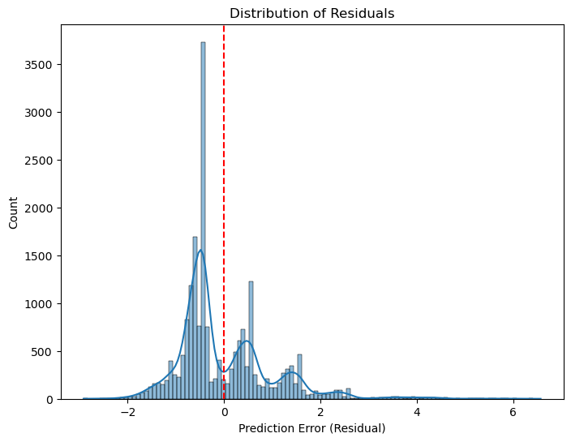
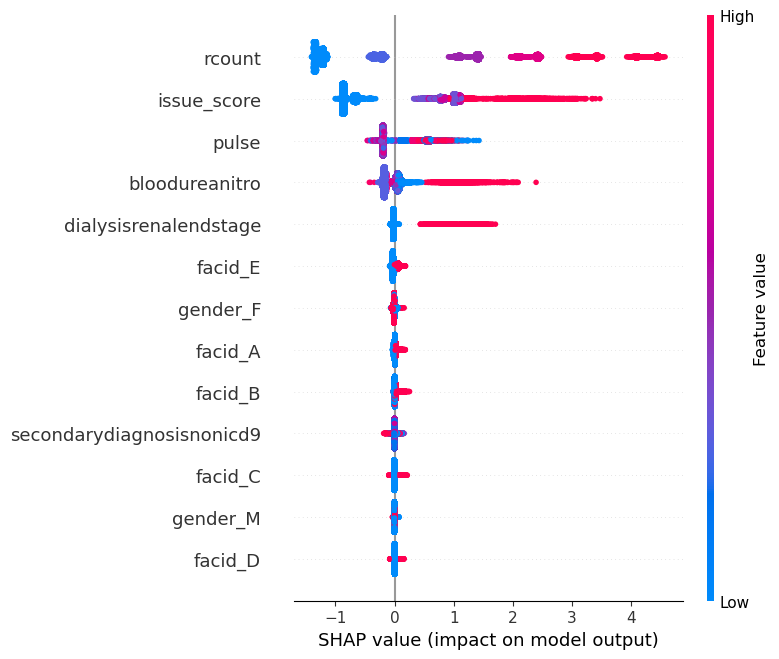

#  Hospital Length of Stay Prediction

This project aims to predict the **length of hospital stay** for patients using structured medical data. Accurately predicting this can help hospitals optimize **bed and staff allocation** and improve **patient flow management**.

---

##  Dataset

- **Source**: [Hospital Length of Stay Dataset (Microsoft) – Kaggle](https://www.kaggle.com/datasets/aayushchou/hospital-length-of-stay-dataset-microsoft/data)
- **Target Variable**: `lengthofstay` (continuous, in days)
- **Features**:
  - Demographics: `gender`, `facid`
  - Diagnoses: Binary columns like `asthma`, `pneum`, `depress`, etc.
  - Vitals/Labs: `bmi`, `glucose`, `sodium`, etc.
  - Administrative: `eid`, `vdate`, `discharged`

---

##  Data Preprocessing

- Dropped columns:
  - `eid`, `vdate`, `discharged` → identifier/date/leakage
  - Low-correlation features (e.g., `glucose`, `bmi`, `sodium`, etc.)
- Created `issue_score`: sum of 10 binary health indicators to capture diagnosis complexity
- One-hot encoded nominal features: `gender`, `facid`
- Standardized numeric features using `StandardScaler`
- Train-test split: 80/20, with `random_state=42` for reproducibility

---

##  Models Used

### 1️ Random Forest Regressor
- **Best Parameters**:
  ```python
  {
    'n_estimators': 100,
    'max_depth': 5,
    'oob_score': True,
    'random_state': 42
  }
  ```
- **Performance**:
  - MAE: **0.809**
  - RMSE: **1.049**
  - R²: **0.799**
  - OOB Score: **0.794**

---

### 2️ XGBoost Regressor
- **Best Parameters**:
  ```python
  {
    'subsample': 0.8,
    'reg_lambda': 10,
    'reg_alpha': 0.5,
    'n_estimators': 300,
    'max_depth': 5,
    'learning_rate': 0.05,
    'colsample_bytree': 0.6
  }
  ```
- **Performance**:
  - MAE: **0.772**
  - RMSE: **0.998**
  - R²: **0.818**

---

### 3️ LightGBM Regressor
- **Best Parameters**:
  ```python
  {
    'subsample': 1.0,
    'reg_lambda': 0,
    'reg_alpha': 0,
    'num_leaves': 70,
    'n_estimators': 300,
    'max_depth': 3,
    'learning_rate': 0.1,
    'colsample_bytree': 0.6
  }
  ```
- **Performance**:
  - MAE: **0.771**
  - RMSE: **0.996**
  - R²: **0.819**

 **Best performing model: LightGBM**

---

##  Model Comparison

| Model       | MAE    | RMSE   | R² Score |
|-------------|--------|--------|----------|
| RandomForest| 0.809  | 1.049  | 0.799    |
| XGBoost     | 0.772  | 0.998  | 0.818    |
| LightGBM    | 0.771  | 0.996  | 0.819  |

---

##  Residual Analysis

- Plotted residuals (`actual − predicted`) using histogram
- Residuals mostly centered around **0** → good prediction quality
- Slight right skew indicates occasional under-predictions
- Multiple peaks suggest unmodeled subgroups


**Residual Distribution Plot:**



---

##  Model Interpretability (SHAP)

Used **SHAP (SHapley Additive Explanations)** to interpret predictions from LightGBM:

- Generated SHAP summary plot showing top features
- Top drivers of prediction:
  - `issue_score` (diagnosis complexity)
  - `dialysisrenalendstage`
  - `bloodureanitro`
  - `pulse`
- SHAP helps understand **how and why** the model makes predictions
**SHAP Summary Plot:**


---

##  Key Takeaways

- Tree-based models (Random Forest, XGBoost, LightGBM) are effective for structured healthcare data
- Preprocessing (feature selection, encoding, scaling) significantly improves model quality
- SHAP adds explainability and trust in model outcomes
- Future improvements may include:
  - Feature engineering (e.g., time-aware or procedure-based features)
  - Segment-wise models (e.g., by facility type)
  - Deep learning extensions for temporal EHR data

---

##  Libraries Used

- `pandas`, `numpy`, `matplotlib`, `seaborn`
- `scikit-learn`
- `xgboost`
- `lightgbm`
- `shap`
- `category_encoders`

---

##  How to Run

```bash
pip install -r requirements.txt
```

Then run the Jupyter Notebook or Python script step-by-step.

